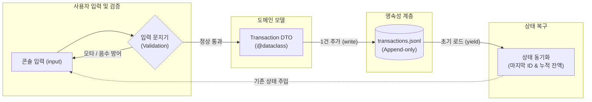
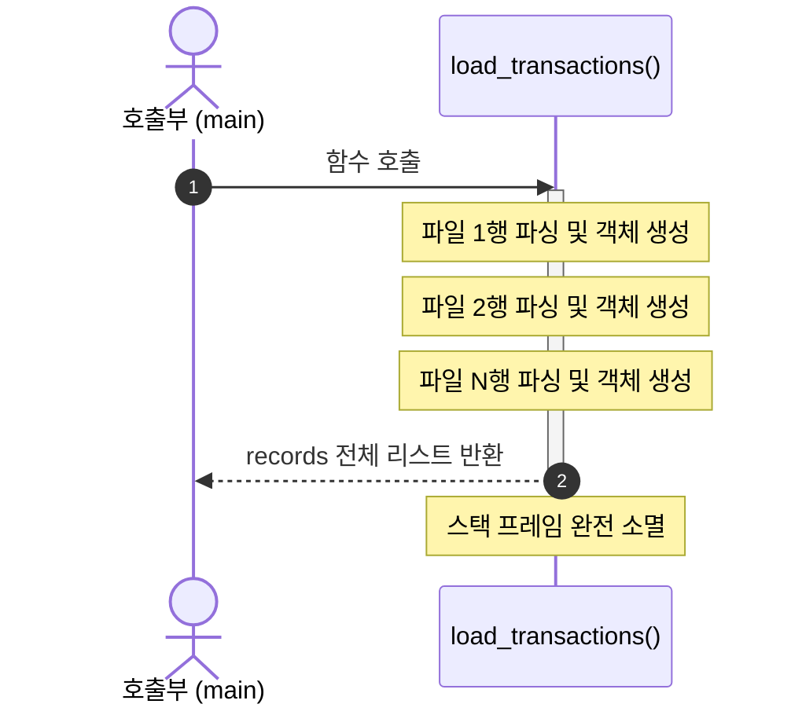
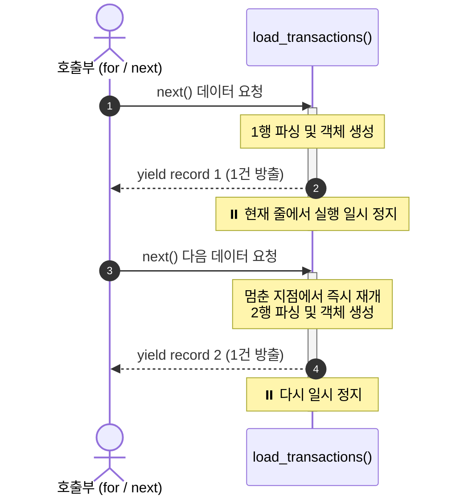
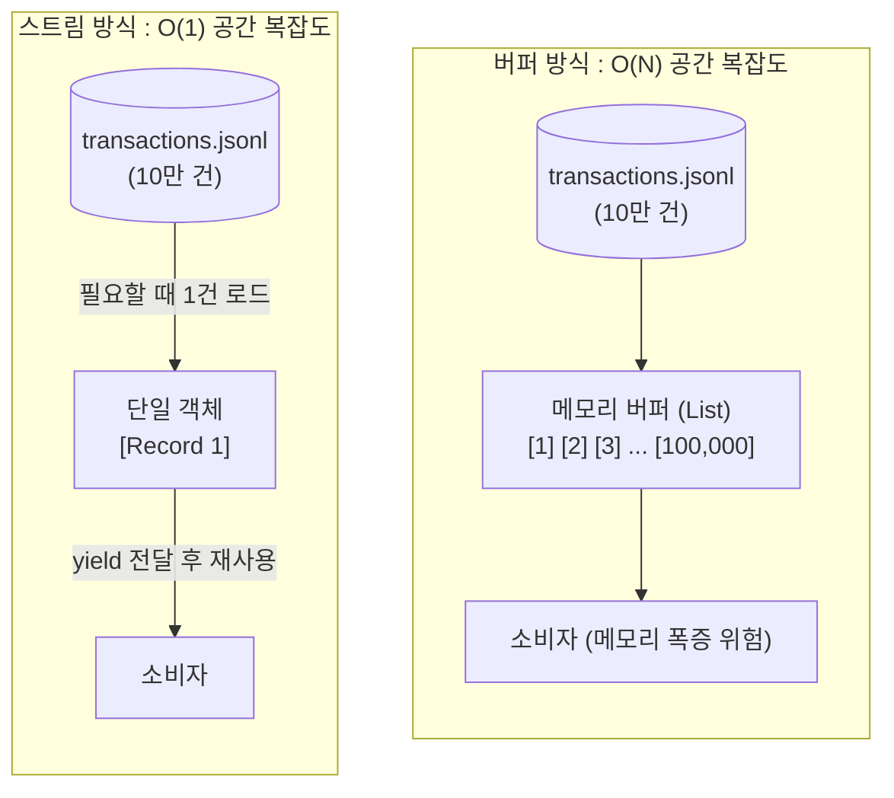
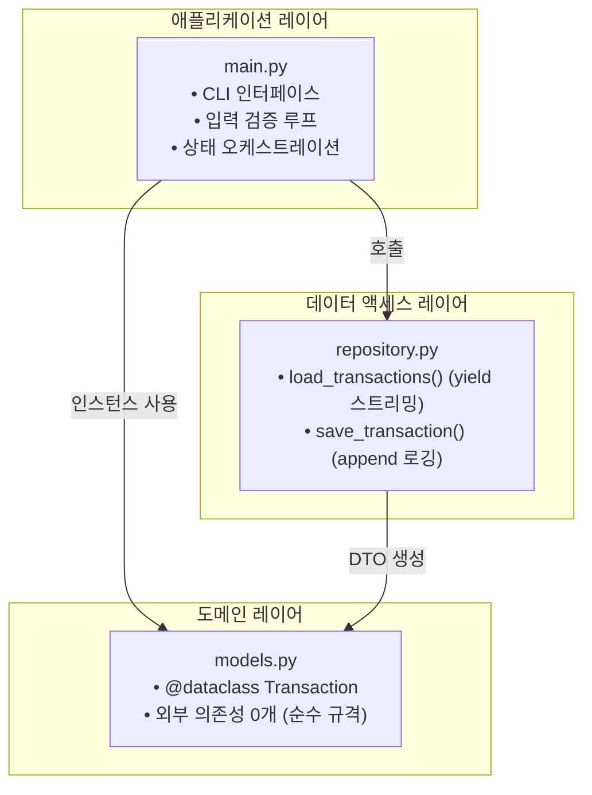

### 1. 시스템 전체 흐름

### 1단계: 수입과 지출의 균형 (현재 코드 확장)
* **핵심 작업:** `spend_money`를 `add_transaction`으로 바꾸고, `type`("income" / "expense")을 받아 잔액을 더하거나 뺍니다.
* **확인:** 터미널에서 월급(수입)과 밥값(지출)을 각각 넣었을 때 잔액이 맞게 계산되는지 봅니다.

### 2단계: 데이터 규격 정의 (Dataclass와 검증)
* **핵심 작업:** 엉성한 딕셔너리 대신 `@dataclass`로 `Transaction` 틀을 만들고, 음수 금액이나 잘못된 날짜를 입력하면 다시 묻도록 만듭니다.
* **확인:** 금액에 `-5000`이나 날짜에 `2026-99-99`를 넣었을 때 프로그램이 죽지 않고 다시 입력을 요구하는지 봅니다.

### 3단계: 첫 번째 기억 (단일 파일 저장, transactions.jsonl)
* **핵심 작업:** 입력받은 거래를 파일 끝에 한 줄씩 추가하고(`a` 모드), 프로그램 실행 시 파일에서 읽어옵니다.
* **확인:** 프로그램을 껐다 켜도 이전에 입력한 내역이 그대로 화면에 나오는지 봅니다.

### 4단계: 흐름 최적화 (제너레이터 스트리밍과 Limit)
* **핵심 작업:** 파일 전체를 리스트에 한 번에 담지 않고, `yield`로 한 줄씩 흘려보내며 최신순으로 `--limit` 개수만 끊어서 출력합니다.
* **확인:** 내역이 여러 개 있어도 원하는 개수(예: 최근 3개)만 깔끔하게 출력되는지 봅니다.

#### 4-1. Eager Evaluation (return)
호출 시 전체 데이터를 한 번에 처리한 뒤 스택 메모리를 완전히 소멸시킵니다.

#### 4-2. Lazy Evaluation (yield)
1건을 방출한 뒤 함수의 실행 위치와 지역 변수 상태를 그대로 보존(일시 정지)합니다.

#### 4-3. 메모리 점유 모델: 버퍼(Buffer) vs 스트림(Stream)
대량 데이터 처리 시 힙(Heap) 메모리 공간 복잡도 비교입니다.

### 5단계: 집의 방 나누기 (3개 모듈 분리)
* **핵심 작업:** 길어진 단일 파일을 코드 수정 없이 세 개(`models.py`, `repository.py`, `main.py`)로 쪼개어 배치합니다.
* **확인:** 파일을 나눈 뒤에도 터미널에서 이전과 똑같이 입력과 조회가 되는지 봅니다.

#### 모듈 분리 구조 및 의존성 방향 (3 Centers & DAG)
순환 참조(Circular Import)가 없는 단방향 의존성 구조입니다.

### 6단계: 이웃 파일의 탄생 (카테고리와 예산 파일)
* **핵심 작업:** `categories.jsonl`과 `budgets.jsonl`을 추가하고, 장부에 등록할 때 "이미 존재하는 카테고리인가?"를 확인합니다.
* **확인:** 없는 카테고리를 입력하면 등록을 거부하고 카테고리 목록을 안내하는지 봅니다.

### 7단계: 안전한 변경 (원자적 수정과 삭제)
* **핵심 작업:** 특정 ID의 거래를 고치거나 지울 때, 원본을 직접 건드리지 않고 임시 파일(`.tmp`)을 거쳐 안전하게 교체(`os.replace`)합니다.
* **확인:** 삭제 명령 후 해당 내역만 장부에서 사라지고 나머지 데이터가 완벽히 보존되는지 봅니다.

### 8단계: 통찰의 도출 (검색과 월별 요약/예산 경고)
* **핵심 작업:** 조건 검색(기간, 카테고리)과 특정 월의 총수입/총지출/잔액, 지출 TOP 카테고리, 예산 초과 경고를 계산합니다.
* **확인:** 예산을 초과해 지출을 기록했을 때 요약 화면에 빨간불(경고 문구)이 뜨는지 봅니다.

### 9단계: 겉옷과 면역 (표준 CLI와 에러 데코레이터)
* **핵심 작업:** `argparse`로 리눅스 표준 옵션(`--`)을 적용하고, `@handle_error` 데코레이터로 스택트레이스(빨간 에러 메시지) 대신 친절한 안내를 띄웁니다.
* **확인:** 터미널에서 이상한 옵션을 쳐도 시스템이 터지지 않고 해결 힌트와 함께 종료 코드 1로 물러나는지 봅니다.

### 10단계: 외부 세계와 연결 (CSV Import & Export)
* **핵심 작업:** 파이썬 내장 `csv` 모듈을 사용해 내역을 CSV 파일로 내보내고, 외부 CSV 파일을 읽어 장부에 안전하게 병합합니다.
* **확인:** 내보낸 CSV 파일이 엑셀에서 열리고, 반대로 외부 파일의 데이터가 장부로 잘 들어오는지 봅니다.