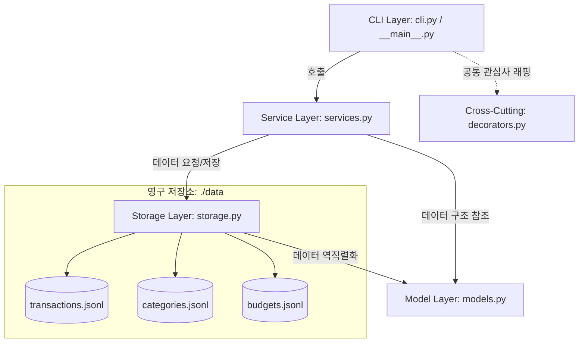
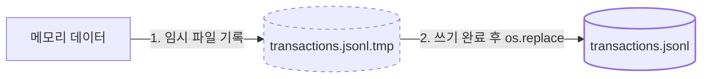
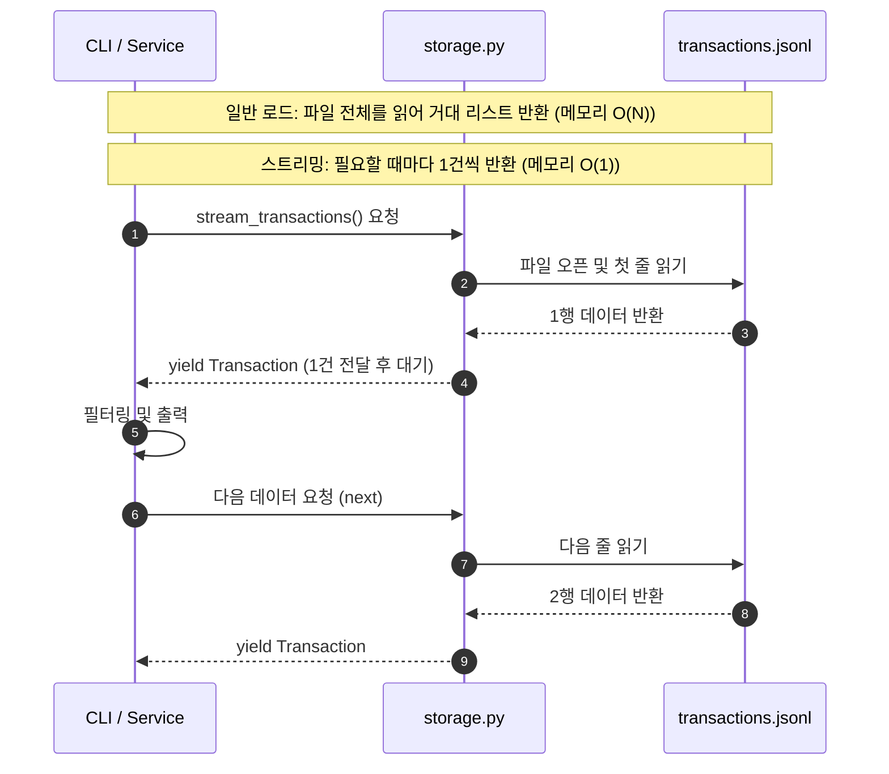
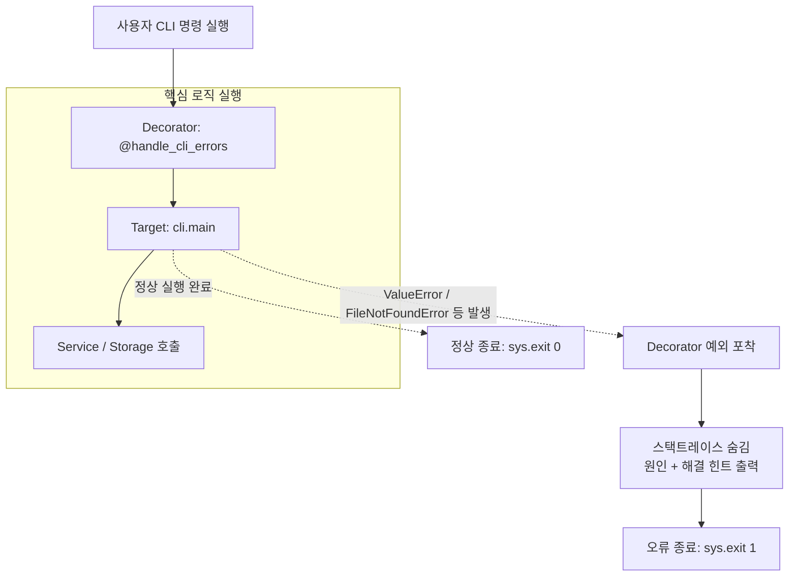
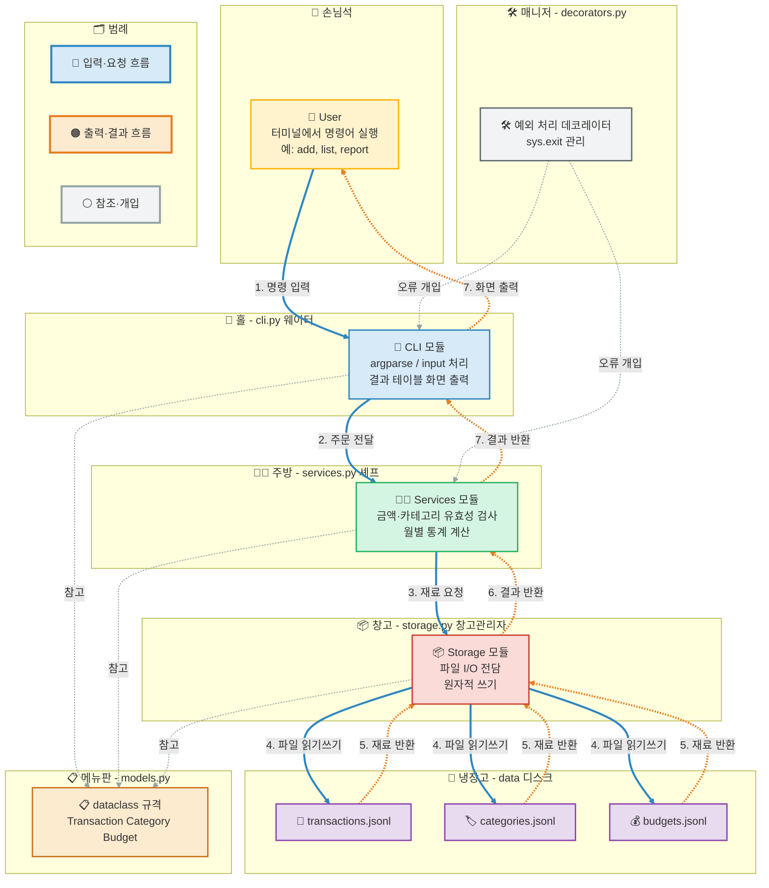

# budget_app

> 파이썬 표준 라이브러리만으로 구현한 CLI 기반 가계부 애플리케이션

`budget_app`은 단일 파일 스크립트로 시작한 가계부 프로그램을 **계층형 아키텍처를 갖춘 모듈형 패키지**로 리팩토링한 프로젝트입니다. 외부 의존성 없이 `json`, `csv`, `argparse`, `dataclasses` 등 표준 라이브러리만을 사용하여, 거래 내역 기록부터 예산 관리, CSV 백업/복원까지 지원하는 완전한 CLI 도구를 목표로 합니다.

---

## 목차

1. [프로젝트 개요](#1-프로젝트-개요)
2. [핵심 기능 및 서브커맨드 사용 예시](#2-핵심-기능-및-서브커맨드-사용-예시)
3. [CSV 스키마 규격](#3-csv-스키마-규격-data-contract)
4. [아키텍처 및 핵심 학습 개념](#4-아키텍처-및-핵심-학습-개념)
5. [디렉터리 구조 및 파일 정책](#5-디렉터리-구조-및-파일-정책)

---

## 1. 프로젝트 개요

### 왜 만들었는가

가계부는 단순한 CRUD 예제처럼 보이지만, 실제로는 아래와 같은 실무형 문제들을 두루 포함하고 있습니다.

- 파일 기반 저장소에서 **데이터 무결성**을 어떻게 보장할 것인가
- 대용량 로그성 데이터를 **메모리 효율적으로** 처리할 것인가
- CLI 도구에서 **일관된 에러 UX**를 어떻게 제공할 것인가
- 여러 데이터 파일 간의 **참조 무결성**(카테고리 삭제 시 거래 보호 등)을 어떻게 지킬 것인가

`budget_app`은 이 문제들을 표준 라이브러리만으로 해결하는 것을 목표로 설계되었습니다.

### 기술 스택 및 제약 조건

| 항목 | 내용 |
| :--- | :--- |
| 런타임 환경 | Python 3.9+ |
| 의존성 정책 | 외부 라이브러리 `pip install` 금지, 표준 라이브러리만 사용 |
| 활용 모듈 | `json`, `csv`, `os`, `sys`, `argparse`, `dataclasses`, `datetime`, `functools`, `typing` |
| 실행 방식 | `python -m budget_app <command> [options]` |
| 데이터 저장 | `./data` 하위 3개 JSONL 파일 분리 저장 |
| 저장 안정성 | 임시 파일(`.tmp`) 기록 후 `os.replace`를 이용한 원자적 쓰기 |
| 대용량 처리 | `yield` 기반 제너레이터 스트리밍 I/O |
| 오류 처리 | `@handle_cli_errors` 데코레이터를 통한 통일된 에러 포맷 및 종료 코드 |
| CLI 옵션 | 리눅스 표준 `--` 롱 옵션 표기 통일 |

---

## 2. 핵심 기능 및 서브커맨드 사용 예시

`budget_app`은 총 10개의 서브커맨드를 제공합니다. 모든 명령은 `python -m budget_app <command>` 형태로 실행합니다.

### 2.1 `add` — 거래 등록 (대화형)

날짜, 타입, 카테고리, 금액, 메모, 태그를 순차적으로 `input()`으로 입력받으며, 존재하지 않는 카테고리를 입력하면 즉시 검증 오류를 반환합니다. 등록이 완료되면 발급된 거래 `id`를 출력합니다.

```bash
$ python -m budget_app add
날짜 (YYYY-MM-DD): 2025-01-15
타입 (income/expense): expense
카테고리: 식비
금액: 12000
메모 (선택): 점심 식사
태그 (쉼표 구분, 선택): 회사,점심

✔ 거래가 등록되었습니다. (id: 7f3a1c9e)
```

### 2.2 `list` — 최신순 목록 조회

`--limit N` 옵션으로 조회 건수를 제한합니다(기본값 20). 내부적으로 스트리밍 제너레이터를 사용해 전체 파일을 메모리에 올리지 않고 테이블을 출력합니다.

```bash
$ python -m budget_app list --limit 5

ID        DATE        TYPE     CATEGORY   AMOUNT    MEMO
7f3a1c9e  2025-01-15  expense  식비       12,000    점심 식사
...
```

### 2.3 `update` — 거래 수정

`--id`로 대상을 지정하고, 수정할 필드만 옵션으로 전달합니다.

```bash
$ python -m budget_app update --id 7f3a1c9e --amount 13000 --memo "점심 식사 (팀 회식 정산 포함)"

✔ 거래(7f3a1c9e)가 수정되었습니다.
```

### 2.4 `delete` — 거래 삭제

존재하지 않는 `id`를 지정하면 원인과 해결 힌트를 함께 출력하고 비정상 종료(`exit 1`)합니다.

```bash
$ python -m budget_app delete --id 7f3a1c9e
✔ 거래(7f3a1c9e)가 삭제되었습니다.

$ python -m budget_app delete --id doesnotexist
✘ 오류: id 'doesnotexist'에 해당하는 거래를 찾을 수 없습니다.
  힌트: 'list' 또는 'search' 명령으로 올바른 id를 확인하세요.
```

### 2.5 `search` — 다중 조건 검색

기간, 카테고리, 타입, 키워드, 태그를 조합하여 검색하고 최신순으로 정렬해 출력합니다.

```bash
$ python -m budget_app search --from 2025-01-01 --to 2025-01-31 --category 식비 --tag 회사
```

### 2.6 `summary` — 월별 결산 요약

수입/지출 합계와 카테고리별 상위 N개 지출 항목, 예산 대비 사용률(%)과 초과 경고 문구를 함께 보여줍니다.

```bash
$ python -m budget_app summary --month 2025-01 --top 3

[2025-01 결산]
총 수입   : 3,200,000
총 지출   : 2,410,000
순수지    : 790,000

지출 TOP 3
1. 식비      680,000
2. 교통비    210,000
3. 구독료    120,000

예산 대비 사용률: 96.4% (예산 2,500,000 / 지출 2,410,000)
⚠ 예산 소진이 임박했습니다.
```

### 2.7 `budget` — 월별 목표 예산 설정

```bash
$ python -m budget_app budget set --month 2025-02 --amount 2500000
✔ 2025-02 예산이 2,500,000원으로 설정되었습니다.
```

### 2.8 `category` — 카테고리 관리

사용 중인 카테고리는 참조 무결성 보호를 위해 삭제가 차단됩니다.

```bash
$ python -m budget_app category list
$ python -m budget_app category add 반려동물
$ python -m budget_app category remove --id 3

✘ 오류: 카테고리(id: 3)는 12건의 거래에서 사용 중이므로 삭제할 수 없습니다.
  힌트: 먼저 해당 카테고리를 사용하는 거래를 다른 카테고리로 이전하거나 삭제하세요.
```

### 2.9 `export` — 조건부 CSV 내보내기

`--out`은 필수이며, `--month` 또는 `--from`/`--to` 중 하나의 기간 조건이 반드시 필요합니다.

```bash
$ python -m budget_app export --out 2025-01.csv --month 2025-01
✔ 42건의 거래가 2025-01.csv 로 내보내졌습니다.
```

### 2.10 `import` — CSV 일괄 등록

행 단위로 유효성을 검증하며, 등록되지 않은 카테고리는 자동으로 생성됩니다.

```bash
$ python -m budget_app import --from backup.csv

✔ 38건 등록 완료, 2건 자동 생성된 카테고리(반려동물, 경조사), 1건 건너뜀(라인 15: amount는 0보다 커야 합니다)
```

---

## 3. CSV 스키마 규격 (Data Contract)

`export`/`import` 명령은 아래 스키마를 공통으로 사용합니다. 인코딩은 엑셀 호환을 위해 BOM이 포함된 `utf-8-sig`를 사용하며, 첫 행에는 반드시 헤더가 포함됩니다.

| Column | Required | Type | 설명 / 형식 |
| :--- | :---: | :--- | :--- |
| **date** | Y | String | 거래 일자 (`YYYY-MM-DD`) |
| **type** | Y | String | 거래 유형 (`income` 또는 `expense`) |
| **category** | Y | String | 등록된 카테고리명 (import 시 없으면 자동 생성) |
| **amount** | Y | Integer | 0보다 큰 양의 정수 |
| **memo** | N | String | 거래 메모 |
| **tags** | N | String | 쉼표(`,`)로 구분된 태그 목록 |

예시:

```csv
date,type,category,amount,memo,tags
2025-01-15,expense,식비,12000,점심 식사,"회사,점심"
2025-01-20,income,급여,3200000,1월 급여,
```

---

## 4. 아키텍처 및 핵심 학습 개념

이 프로젝트는 단순히 동작하는 CLI를 만드는 것을 넘어, 다음 5가지 소프트웨어 설계 개념을 의도적으로 학습하고 적용하는 것을 목표로 했습니다.

### 4.1 계층 분리 모델 (Architecture & Responsibility)

`budget_app`은 **CLI → Service → Storage/Model**로 이어지는 단방향 의존성 흐름을 따릅니다. 각 계층은 자신의 책임만 수행하며, 상위 계층은 하위 계층을 알지만 그 반대는 성립하지 않습니다.

- **CLI Layer (`cli.py`, `__main__.py`)**: `argparse` 기반 서브커맨드 파싱과 사용자 입출력(대화형 `input()`, 테이블 출력)을 담당합니다. 비즈니스 로직을 직접 수행하지 않고 Service Layer를 호출합니다.
- **Service Layer (`services.py`)**: 입력 검증, 참조 무결성 검사(카테고리 삭제 차단 등), 결산·예산 연산, CSV 입출력 등 실제 비즈니스 로직을 담당합니다.
- **Storage Layer (`storage.py`)**: JSONL 파일에 대한 원자적 쓰기와 제너레이터 기반 스트리밍 읽기를 담당하는 영속 계층입니다.
- **Model Layer (`models.py`)**: `@dataclass`로 정의된 `Transaction`, `Category`, `Budget` — 어떤 로직도 갖지 않는 순수한 데이터 계약입니다.
- **Cross-Cutting (`decorators.py`)**: 계층을 가로질러 CLI 진입점을 감싸는 공통 관심사(에러 처리)를 분리합니다.



이러한 단방향 흐름 덕분에 예를 들어 저장 방식을 JSONL에서 SQLite로 교체하더라도 Storage Layer만 수정하면 되고, CLI나 Service Layer의 코드는 그대로 유지할 수 있습니다.

### 4.2 원자적 쓰기 (Atomic Write: 데이터 무결성 보장)

파일을 직접 열어 덮어쓰는 방식은 쓰기 도중 프로세스가 중단되거나 예외가 발생하면 파일이 **반쯤 쓰여진 상태로 손상**될 위험이 있습니다. `budget_app`은 이를 방지하기 위해 다음 절차를 따릅니다.

1. 원본 파일(`transactions.jsonl`)을 직접 열지 않고, 동일한 디렉터리에 임시 파일(`transactions.jsonl.tmp`)을 새로 생성합니다.
2. 갱신된 전체 데이터를 임시 파일에 모두 기록하고 `flush()` 및 `os.fsync()`로 디스크에 확실히 반영합니다.
3. 쓰기가 완전히 성공한 경우에만 `os.replace(tmp_path, original_path)`를 호출해 원본을 교체합니다.

`os.replace`는 (같은 파일시스템 내에서) **원자적 연산**이므로, 교체 도중 프로세스가 강제 종료되더라도 파일은 "교체 전 원본" 또는 "교체 후 새 파일" 둘 중 하나의 완전한 상태로만 존재하며, 중간의 손상된 상태로 남지 않습니다.



### 4.3 `yield` 기반 제너레이터 스트리밍 (Generator Streaming)

거래 내역이 수만 건 이상으로 늘어나는 상황을 가정하면, 파일 전체를 한 번에 읽어 리스트로 반환하는 방식은 메모리 사용량이 데이터 크기에 비례해 증가합니다 (공간 복잡도 $O(N)$).

`budget_app`의 `storage.py`는 대신 `yield`를 사용한 제너레이터 함수(`stream_transactions()` 등)를 제공합니다. 파일을 한 줄씩 읽어 그 즉시 `Transaction` 객체로 역직렬화해 호출자에게 넘겨주고, 호출자가 다음 데이터를 요청(`next()`)할 때까지 함수 실행을 그 지점에서 일시 정지합니다. 이 방식은 항상 메모리에 한 건(또는 상수 개)의 레코드만 유지하므로 공간 복잡도가 $O(1)$에 가깝습니다. `list`, `search`, `summary`처럼 전체 데이터를 순회하며 필터링/집계만 하면 되는 명령들은 모두 이 스트리밍 방식을 사용합니다.



### 4.4 데코레이터를 통한 공통 관심사 분리 (Cross-Cutting Concerns)

리팩토링 이전에는 `add`, `update`, `delete` 등 거의 모든 CLI 함수 내부에 동일한 형태의 `try-except` 블록이 반복되었습니다. `budget_app`은 이를 `decorators.py`의 `@handle_cli_errors`로 한 곳에 모았습니다.

- 각 서브커맨드 핸들러는 오류 처리 코드 없이 **핵심 로직만** 작성합니다.
- `@handle_cli_errors`가 핸들러 실행을 감싸며, `ValueError`, `FileNotFoundError` 등 예상 가능한 예외를 포착합니다.
- 예외 발생 시 내부 스택트레이스는 사용자에게 노출하지 않고, **원인(무엇이 잘못되었는지)**과 **해결 힌트(어떻게 고칠 수 있는지)**를 함께 출력한 뒤 `sys.exit(1)`로 종료합니다.
- 정상적으로 실행이 끝나면 `sys.exit(0)`(또는 암묵적 정상 종료)으로 마무리되어, 쉘 스크립트나 CI 파이프라인에서 종료 코드만으로 성공/실패를 판단할 수 있습니다.



### 4.5 타입 힌트와 데이터 계약 (Type Hints as Contracts)

`models.py`의 모든 엔티티는 `@dataclass`로 정의됩니다. `@dataclass`는 `__init__`, `__repr__`, `__eq__`를 자동 생성해줄 뿐 아니라, 필드마다 타입을 명시하도록 강제해 **데이터 구조 자체를 하나의 계약(contract)**으로 만듭니다.

```python
@dataclass
class Transaction:
    id: str
    date: str
    type: str
    category: str
    amount: int
    memo: Optional[str] = None
    tags: List[str] = field(default_factory=list)
```

`typing` 모듈의 `Generator`, `Optional`, `List`, `Tuple` 등은 이 계약을 함수 시그니처까지 확장합니다.

- `Storage.stream_transactions() -> Generator[Transaction, None, None]`처럼 반환 타입을 명시하면, 호출부에서 "이 함수는 리스트가 아니라 지연 평가되는 스트림을 반환한다"는 의도가 코드만 보고도 명확해집니다.
- `Optional[str]`은 `memo` 필드처럼 값이 없을 수 있는 필드를 명시적으로 드러내, `None` 처리를 빠뜨리는 실수를 정적 분석 도구(mypy 등)로 사전에 잡아낼 수 있게 합니다.
- 함수 시그니처가 곧 문서 역할을 하므로, 여러 사람이 동시에 `services.py`와 `cli.py`를 수정하더라도 인터페이스가 암묵적으로 번복될 가능성이 줄어듭니다.

즉, 타입 힌트는 런타임에 강제되지는 않지만 **팀 내 합의된 인터페이스를 코드 수준에서 문서화**하고, 정적 분석 도구와 결합했을 때 런타임 오류를 사전에 방지하는 효과를 가져옵니다.

---

## 5. 디렉터리 구조 및 파일 정책

### 5.1 패키지 구조

```text
budget_app/
├── __init__.py
├── __main__.py      # CLI 진입점 (python -m budget_app)
├── models.py        # 순수 데이터 계약 (@dataclass 기반 Transaction, Category, Budget)
├── storage.py        # 영속 계층 (Atomic Write, JSONL I/O, Generator Streaming)
├── services.py       # 비즈니스 로직 (입력 검증, 참조 무결성 검사, 결산 및 예산 연산, CSV 입출력)
├── decorators.py     # 공통 관심사 분리 (@handle_cli_errors)
└── cli.py            # argparse 기반 서브커맨드 파서 및 대화형 UI
```

### 5.2 데이터 파일 정책

| 파일 | 역할 | 비고 |
| :--- | :--- | :--- |
| `data/transactions.jsonl` | 거래 내역 저장소 | 1행 = 1거래(JSON), append 위주, 수정/삭제 시 전체 재기록 후 원자적 교체 |
| `data/categories.jsonl` | 카테고리 마스터 | 거래에서 참조 중인 카테고리는 삭제 차단 |
| `data/budgets.jsonl` | 월별 목표 예산 | `YYYY-MM` 단위로 1건씩 저장, 동일 월 재설정 시 갱신 |

세 파일 모두 JSON Lines(`.jsonl`) 포맷을 사용해 **한 줄이 하나의 레코드**가 되도록 설계했습니다. 이는 §4.3에서 설명한 제너레이터 스트리밍(줄 단위 파싱)과 §4.2의 원자적 쓰기(전체 재기록 후 교체) 모두와 자연스럽게 맞물리는 선택입니다.

### 5.3 실행 전 준비

```bash
# 데이터 디렉터리는 최초 실행 시 자동 생성됩니다.
$ python -m budget_app category add 식비
$ python -m budget_app category add 교통비
$ python -m budget_app budget set --month 2025-01 --amount 2500000
$ python -m budget_app add
```

---




**색상-흐름 대응표**

| 색 | 인덱스 | 흐름 | 방향 |
|---|---|---|---|
| 🔵 파랑 굵은 실선 | 0~5 | 입력(요청) | 손님 → 웨이터 → 셰프 → 창고 → 냉장고 |
| 🟠 주황 점선 | 6~11 | 출력(결과) | 냉장고 → 창고 → 셰프 → 웨이터 → 손님 |
| ⚪ 회색 얇은 점선 | 12~16 | 참조/개입 | 각 계층 → 메뉴판, 매니저 → 웨이터/셰프 |


## 💡 CLI 조작법 요약

모든 명령어는 프로젝트 루트에서 `python -m budget_app <command> [options]` 형식으로 실행합니다.

| 서브커맨드 | 주요 옵션 / 인자 | 입력 방식 | 실행 명령어 예시 | 비고 / 주의사항 |
| :--- | :--- | :---: | :--- | :--- |
| **`add`** | 없음 | 대화형 | `python -m budget_app add` | 날짜 미입력 시 오늘 자동 지정, 카테고리 사전 검증 |
| **`list`** | `--limit <N>` | 옵션 | `python -m budget_app list --limit 10` | 기본값 20건, 최신순 정렬 및 스트리밍 출력 |
| **`update`** | `--id <ID>` (필수)<br>`--date`, `--type`, `--category`<br>`--amount`, `--memo`, `--tags` | 옵션 | `python -m budget_app update --id 1 --amount 15000` | 미존재 ID 입력 시 에러 반환, 변경할 항목만 선택 전달 |
| **`delete`** | `--id <ID>` (필수) | 옵션 | `python -m budget_app delete --id 1` | 미존재 ID 입력 시 에러 반환 (Exit Code: 1) |
| **`search`** | `--from`, `--to`, `--category`<br>`--type`, `--q`, `--tag` | 옵션 | `python -m budget_app search --category 식비 --q 점심` | 다중 조건 AND 필터링, 최신순 정렬 출력 |
| **`summary`** | `--month <YYYY-MM>` (필수)<br>`--top <N>` | 옵션 | `python -m budget_app summary --month 2026-09 --top 3` | 수입/지출/잔액 집계, 카테고리 TOP N, 예산 사용률 연동 |
| **`budget`** | `set --month <YYYY-MM>`<br>`--amount <금액>` | 하위명령 / 옵션 | `python -m budget_app budget set --month 2026-09 --amount 500000` | `budgets.jsonl`에 영구 보존, 월별 목표 지출 설정 |
| **`category`** | `list`<br>`add <이름>`<br>`remove --id <ID>` | 하위명령 / 옵션 | `python -m budget_app category list`<br>`python -m budget_app category add 여가비`<br>`python -m budget_app category remove --id 5` | 사용 중인 카테고리는 삭제 차단 (참조 무결성 보호) |
| **`export`** | `--out <파일>` (필수)<br>`--month` 또는 `--from`/`--to` | 옵션 | `python -m budget_app export --out backup.csv --month 2026-09` | 기간/월 조건 중 1개 이상 필수, UTF-8 (`utf-8-sig`) |
| **`import`** | `--from <파일>` (필수) | 옵션 | `python -m budget_app import --from backup.csv` | 행 단위 검증, 미등록 카테고리 자동 추가, 건수 집계 |

> **전역 공통 옵션**
> * `--help`: 전체 명령어 또는 각 서브커맨드 세부 옵션 도움말 출력
> * `--data-dir <디렉터리경로>`: 데이터 파일 저장 경로 변경 (기본값: `./data`)