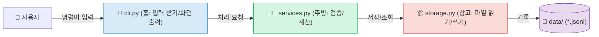

# budget_app

> 외부 라이브러리 설치 없이, 파이썬 표준 라이브러리만으로 만든 터미널(CLI) 가계부 프로그램입니다.

처음에는 하나의 파일에 코드를 모두 작성했으나, 기능이 늘어날수록 코드가 엉키는 문제를 겪었습니다.  
이 문제를 해결하기 위해 **화면 입력(CLI), 계산 및 검증(Service), 파일 입출력(Storage)**으로 역할을 깔끔하게 나누어 다시 설계했습니다.

---

## 📌 목차

1. [왜 만들었는가? (프로젝트 동기)](#1-왜-만들었는가-프로젝트-동기)
2. [사용한 기술과 원칙](#2-사용한-기술과-원칙)
3. [프로그램 구조 (역할 분담)](#3-프로그램-구조-역할-분담)
4. [문제를 해결한 핵심 방법 5가지](#4-문제를-해결한-핵심-방법-5가지)
5. [현재의 한계점과 앞으로 개선할 점](#5-현재의-한계점과-앞으로-개선할-점)
6. [명령어 사용법 및 조작 요약](#6-명령어-사용법-및-조작-요약)

---

## 1. 왜 만들었는가? (프로젝트 동기)

간단한 가계부를 만들더라도 실제 파일로 데이터를 다루다 보면 여러 현실적인 문제와 마주하게 됩니다.

- 프로그램이 도중에 강제로 꺼지면 **작성 중이던 파일이 통째로 깨지지 않을까?**
- 거래 내역이 수천, 수만 개로 늘어나면 **파일을 읽을 때 컴퓨터 메모리를 너무 많이 쓰지 않을까?**
- 사용 중인 카테고리를 실수로 지워버리면 **기존 거래 내역의 카테고리는 어떻게 될까?**
- 사용자가 잘못된 값을 넣었을 때 복잡한 파이썬 에러(Traceback) 대신 **어떻게 친절하게 안내할까?**

`budget_app`은 외부 패키지(`pip`)의 힘을 빌리지 않고, 파이썬 기본 기능만으로 이러한 실질적인 문제들을 직접 풀어보고자 만든 프로젝트입니다.

---

## 2. 사용한 기술과 원칙

- **파이썬 버전**: Python 3.9 이상
- **외부 의존성 제로**: 별도 라이브러리 설치 없이 기본 내장 모듈(`json`, `csv`, `argparse`, `dataclasses`, `datetime` 등)만 사용
- **데이터 저장**: `./data` 폴더 아래 3개의 텍스트 파일(JSON Lines: `.jsonl`)로 나누어 보관
- **실행 방식**: `python -m budget_app <명령어> [옵션]`

---

## 3. 프로그램 구조 (역할 분담)

마치 **식당**에서 손님을 응대하는 홀, 음식을 만드는 주방, 식자재를 보관하는 창고가 나뉘어 있듯이 코드의 역할을 3개의 계층으로 깔끔하게 나누었습니다.

```mermaid
flowchart LR
    User["👤 사용자"] -->|"명령어 입력"| CLI["🤵 cli.py (홀: 입력 받기/화면 출력)"]
    CLI -->|"처리 요청"| Service["👨‍🍳 services.py (주방: 검증/계산)"]
    Service -->|"저장/조회"| Storage["📦 storage.py (창고: 파일 읽기/쓰기)"]
    Storage -->|"기록"| Data[("💾 data/ (*.jsonl)")]

    style CLI fill:#D6EAF8,stroke:#2E86C1
    style Service fill:#D5F5E3,stroke:#28B463
    style Storage fill:#FADBD8,stroke:#CB4335
    style Data fill:#E8DAEF,stroke:#8E44AD
```

- **`cli.py`**: 사용자가 터미널에 입력한 명령어를 읽어들이고, 결과를 보기 좋게 표 형태로 화면에 출력합니다.
- **`services.py`**: 날짜나 금액이 올바른지 검사하고, 월별 통계를 계산하거나 카테고리 삭제 가능 여부를 판단합니다.
- **`storage.py`**: 파일(`.jsonl`, `.csv`)을 직접 열고 닫으며 데이터를 저장하고 불러오는 작업만 전담합니다.
- **`models.py`**: 거래 내역(`Transaction`), 카테고리(`Category`), 예산(`Budget`)의 데이터 형태를 정해둔 기준표입니다.
- **`decorators.py`**: 명령어를 실행하다 에러가 났을 때 한곳에서 가로채어 친절한 힌트 메시지를 띄워줍니다.

---

## 4. 문제를 해결한 핵심 방법 5가지

### ① 임시 파일을 이용한 안전한 저장 (파일 깨짐 방지)
파일을 직접 열어서 바로 덮어쓰다 컴퓨터가 꺼지면 파일 내용이 반만 쓰여 영구적으로 망가질 수 있습니다.
이를 막기 위해 먼저 **임시 파일(`.tmp`)에 새 데이터를 모두 다 쓴 뒤**, 저장이 완벽히 끝났을 때 `os.replace`로 원본 파일과 이름을 한 번에 바꿔치기하도록 구현했습니다.

### ② 한 줄씩 읽어오는 방식 (`yield` 제너레이터)
데이터가 많아졌을 때 파일 전체를 한꺼번에 리스트로 다 불러오면 메모리를 불필요하게 낭비하게 됩니다.  
`storage.py`에서는 파일을 한 줄 읽고 넘겨주는 **`yield` 제너레이터**를 사용하여 메모리 부담을 덜어내도록 설계했습니다.

### ③ 사용 중인 카테고리 보호 (데이터 꼬임 방지)
거래 내역에 이미 등록되어 사용 중인 카테고리는 함부로 삭제할 수 없게 막았습니다. 만약 카테고리가 덜컥 지워지면 기존 거래 내역의 카테고리가 미아가 되기 때문입니다. 삭제 명령이 들어오면 거래 내역을 먼저 확인하여 사용 중일 경우 삭제를 안전하게 차단합니다.

### ④ 3단계 입력 검증 (친절한 오류 안내)
사용자가 잘못된 값을 넣었을 때 프로그램이 그냥 튕기지 않도록 3단계로 확인합니다.
1. 날짜가 `YYYY-MM-DD` 형식에 맞는지 확인
2. 텍스트 앞뒤의 불필요한 공백을 제거하고 형태 정리
3. 금액이 0보다 큰지, 존재하는 카테고리인지 확인

### ⑤ 엑셀에서도 한글이 깨지지 않는 CSV 저장 (`utf-8-sig`)
가계부 데이터를 엑셀에서 열었을 때 한글이 깨지는 현상을 방지하기 위해, 파일 맨 앞에 엑셀이 UTF-8임을 알아볼 수 있는 표시(BOM)를 붙여주는 `utf-8-sig` 인코딩을 적용했습니다.

---

## 5. 현재의 한계점과 앞으로 개선할 점 (솔직한 성찰)

직접 구현해보며 알게 된 현재 구조의 아쉬운 점과 향후 개선 로드맵입니다.

1. **거래 등록 시 ID 발급 속도**:  
   새 거래를 추가할 때 가장 큰 ID 번호를 찾기 위해 파일 전체를 순회하고 있습니다. 데이터가 수만 건 이상으로 늘어나면 느려질 수 있어, 다음 ID 번호를 별도 파일에 적어두거나 파일의 맨 마지막 줄만 읽어오는 방식으로 개선할 계획입니다.
2. **최신순 정렬 시 메모리 사용**:  
   파일은 과거부터 순서대로 적히기 때문에, 최신순 목록을 보여주기 위해선 결국 데이터를 모아서 뒤집어야 합니다. 데이터가 아주 커질 경우 이 부분 역시 메모리 부담이 생기므로, 대용량 데이터를 다룰 때는 색인(Index) 기능이 있는 **SQLite** 같은 경량 데이터베이스로 발전시킬 필요가 있음을 배웠습니다.

---

## 6. 명령어 사용법 및 조작 요약

프로젝트 루트 폴더에서 `python -m budget_app <명령어>` 형태로 실행합니다.

| 명령어 | 주요 기능 | 실행 예시 |
| :--- | :--- | :--- |
| **`add`** | 새 거래 등록 (질문-답변 대화형) | `python -m budget_app add` |
| **`list`** | 최근 거래 내역 조회 (개수 지정 가능) | `python -m budget_app list --limit 10` |
| **`update`** | 특정 번호(ID) 거래 수정 | `python -m budget_app update --id 1 --amount 15000` |
| **`delete`** | 특정 번호(ID) 거래 삭제 | `python -m budget_app delete --id 1` |
| **`search`** | 기간, 카테고리, 메모 키워드로 검색 | `python -m budget_app search --category 식비 --q 점심` |
| **`summary`** | 특정 월의 수입/지출 결산 및 상위 지출 카테고리 | `python -m budget_app summary --month 2026-09 --top 3` |
| **`budget`** | 월별 목표 지출 예산 설정 | `python -m budget_app budget set --month 2026-09 --amount 500000` |
| **`category`** | 카테고리 목록 보기, 추가, 삭제 | `python -m budget_app category list` `python -m budget_app category add 카페` |
| **`export`** | 거래 내역을 CSV 파일로 내보내기 | `python -m budget_app export --out backup.csv --month 2026-09` |
| **`import`** | CSV 파일에서 거래 내역 불러오기 | `python -m budget_app import --from backup.csv` |

> 💡 각 명령어 뒤에 `--help`를 붙이면(예: `python -m budget_app export --help`) 입력해야 하는 자세한 옵션 설명을 터미널에서 바로 확인할 수 있습니다.